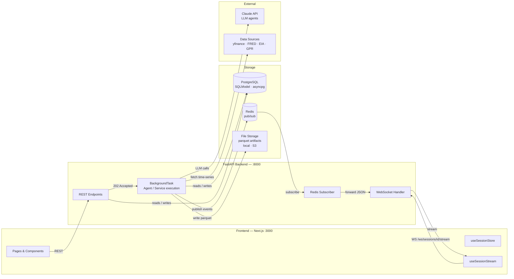
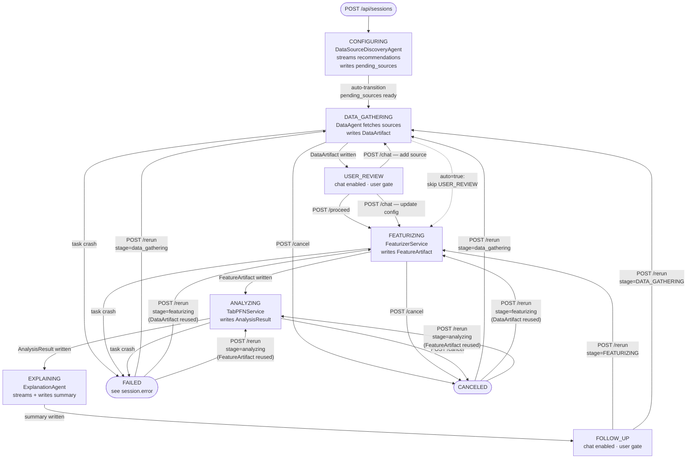
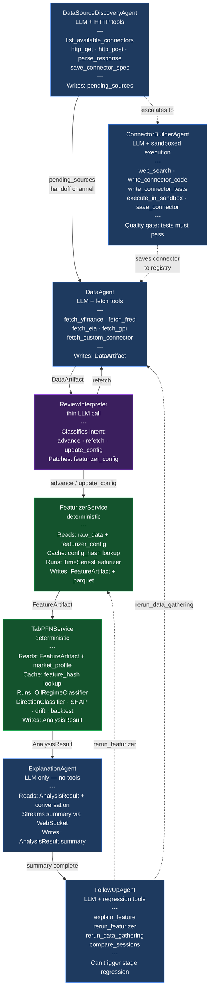
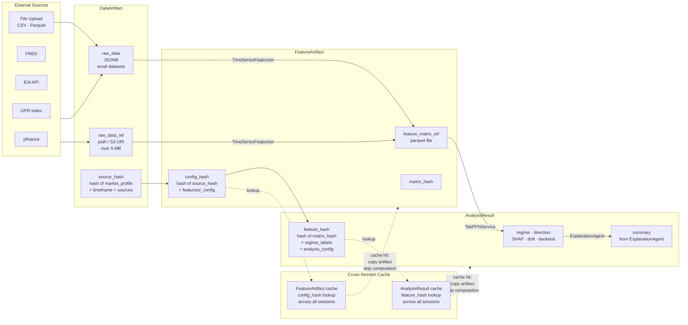
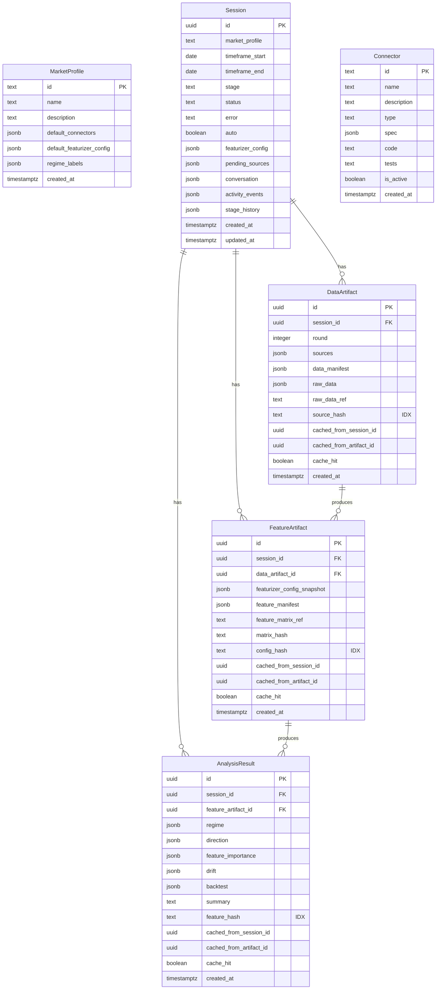

# Signalyst — Architecture Diagrams

Four Mermaid diagrams derived from `docs/backend-redesign.md` and `docs/frontend-redesign.md`.

---

## 1. System Components

High-level infrastructure: how the frontend, backend, storage, LLM API, and external data sources connect, and how the 202 → BackgroundTask → Redis → WebSocket pattern works.

---

## 2. Session Pipeline & Stage Machine

All 7 stages, transition triggers, USER_REVIEW gate branches, auto mode bypass, FOLLOW_UP rerun regression, and terminal FAILED / CANCELED states. `POST /rerun { stage }` can resume from any prior stage — existing artifacts in the DB are reused, only the specified stage and beyond re-run.

---

## 3. Multi-Agent Pipeline

Which agent or deterministic service runs at each stage, their key tools, inputs/outputs, and handoff points. LLM agents and deterministic services are styled separately.

**Legend:** Blue = LLM agent · Green = deterministic service · Purple = thin LLM call

---

## 4a. Data & Artifact Flow

How raw data flows through the pipeline, how the three-level artifact cache works (source_hash → config_hash → feature_hash), and the two storage tiers for raw data.

---

## 4b. Database Schema

Entity relationships for all six tables. Hash fields with indexes are marked `IDX`.

